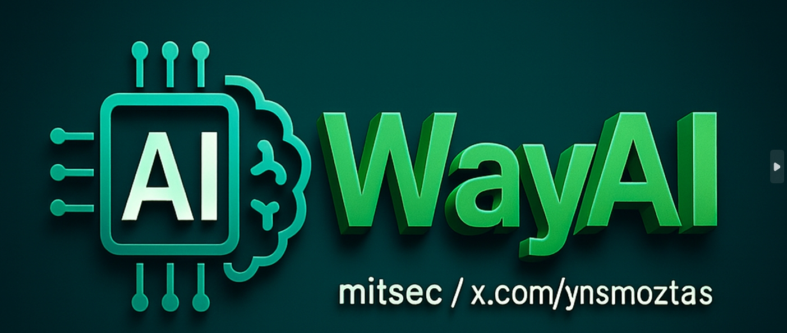

# WayAI — Wayback & Common Crawl Recon (CLI + Web GUI)
**Powered by [ynsmroztas](https://x.com/ynsmroztas)** • **powered by mitsec**



WayAI provides:
- `wayai_cli/WayAI.py`: CLI recon tool (Wayback + Common Crawl + subdomain extraction + diffs + optional HTTP status)
- `webgui/`: Flask Web GUI with Bootstrap (same core features, tabbed results)

## Quick Start (CLI)
```bash
python3 -m venv .venv && source .venv/bin/activate
pip install -r wayai_cli/requirements.txt
python wayai_cli/WayAI.py --domain target.com --include-commoncrawl --status --scan-subs
```

## Quick Start (Web GUI)
```bash
python3 -m venv .venv && source .venv/bin/activate
pip install -r webgui/requirements.txt
python webgui/app.py
# open http://localhost:8080
```

## Docker (Web GUI)
```bash
docker build -t wayai .
docker run --rm -p 8080:8080 wayai
```

## Repo Layout
```
WayAI_GitHubRepo/
├─ wayai_cli/
│  ├─ WayAI.py
│  └─ requirements.txt
├─ webgui/
│  ├─ app.py
│  ├─ requirements.txt
│  └─ templates/
│     ├─ index.html
│     └─ results.html
├─ assets/
├─ .github/workflows/ci.yml
├─ .gitignore
├─ Dockerfile
└─ README.md
```

---
Follow updates: **x.com/ynsmroztas** — Repo branding: WayAI  • powered by mitsec •
